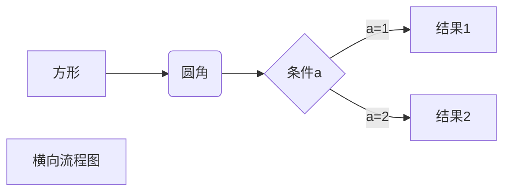
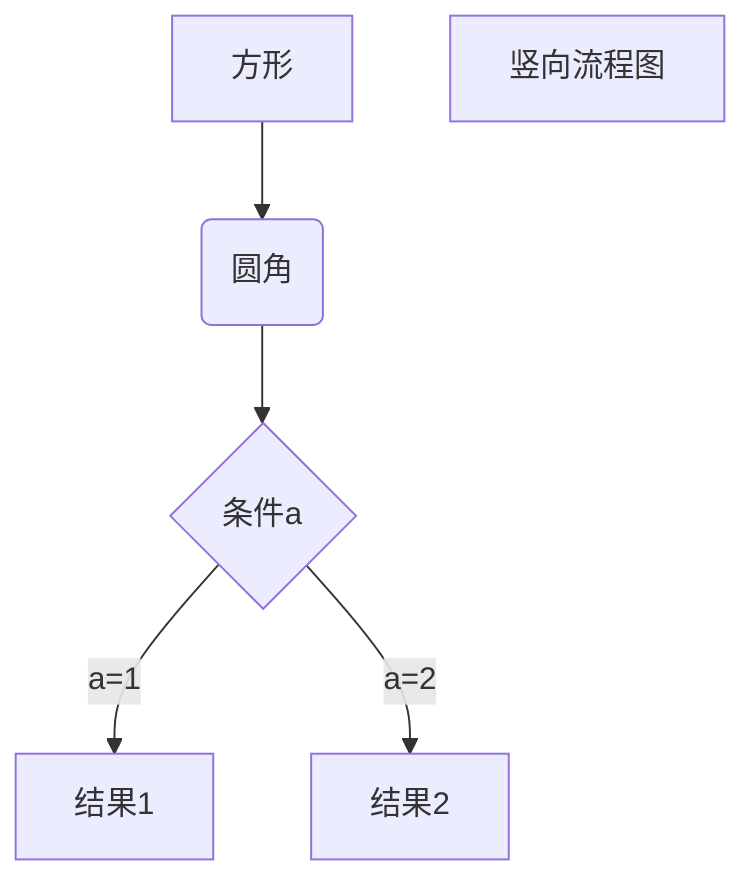

#  一、行内语法

##  1.1 分级标题、任务列表

### 任务列表

```
- [ ] 任务一 未做任务 `- + 空格 + [ ]`
- [x] 任务二 已做任务 `- + 空格 + [x]`
```

- [ ] 任务一 未做任务 `- + 空格 + [ ]`

- [x] 任务二 已做任务 `- + 空格 + [x]`

  

## 1.2  缩进、换行、空行、对齐方式

### **首行缩进**

```
【1】 &emsp;或&#8195; //全角
【2】 &ensp;或&#8194; //半角
【3】 &nbsp;或&#160;  //半角之半角
```

【1】 &emsp;或&#8195; //全角
【2】 &ensp;或&#8194; //半角
【3】 &nbsp;或&#160;  //半角之半角


### **对齐方式**

```xml
<center>行中心对齐</center>
<p align="left">行左对齐</p>
<p align="right">行右对齐</p>
```

<center>行中心对齐</center>
<p align="left">行左对齐</p>
<p align="right">行右对齐</p>
## 1.3  斜体、粗体、删除线、下划线、背景高亮

```undefined
*斜体*或_斜体_
**粗体**
***加粗斜体***
~~删除线~~
++下划线++
==背景高亮==
```

*斜体*或_斜体_
**粗体**
***加粗斜体***
~~删除线~~
++下划线++
==背景高亮==


## 1.4 超链接、页内链接、自动链接、注脚

### **行内式**

```bash
欢迎阅读 [yonyong](https://www.cnblogs.com/yonyong/ "yonyong")
```

欢迎阅读 [yonyong](https://www.cnblogs.com/yonyong/ "yonyong")


### **参考式**

```ruby
我经常去的几个网站[Google][1]、[Leanote][2]。

[1]:http://www.google.com 
[2]:http://www.leanote.com
```

我经常去的几个网站[Google][1]、[Leanote][2]。

[1]:http://www.google.com
[2]:http://www.leanote.com


### **注脚**

```css
使用 Markdown[^1]可以效率的书写文档, 直接转换成 HTML[^2]。

[^1]:Markdown是一种纯文本标记语言

[^2]:HyperText Markup Language 超文本标记语言
```

使用 Markdown[^1]可以效率的书写文档, 直接转换成 HTML[^2]。

[^1]:Markdown是一种纯文本标记语言

[^2]:HyperText Markup Language 超文本标记语言


### **锚点（页内超链接）**

```bash
## 0. 目录{#index}
```

> ####  0. 目录
>
> ####  {#index}


### 自动链接

```dart
&lt;http://example.com/&gt; &emsp;&emsp; 
&lt;address@example.com&gt;
```

&lt;http://example.com/ &gt; &emsp;&emsp; 
&lt;address@example.com&gt;


## 1.5 无序列表、有序列表、定义型列表

### **无序列表**

```undefined
使用 *，+，- 表示无序列表。

* 无序列表项 一
+ 无序列表项 二
- 无序列表项 三
```

* 无序列表项 一
+ 无序列表项 二

- 无序列表项 三


### **有序列表**

```undefined
有序列表则使用数字接着一个英文句点。
1. 有序列表项 一
2. 有序列表项 二
3. 有序列表项 三
```

1. 有序列表项 一
2. 有序列表项 二
3. 有序列表项 三


### *定义型列表表*

```undefined
Markdown
:   轻量级文本标记语言（左侧有一个可见的冒号和四个不可见的空格）
```

Markdown
:   轻量级文本标记语言（左侧有一个可见的冒号和四个不可见的空格）


## 1.6 插入图像

```xml
<center>  <!--开始居中对齐-->


格式: 
</center> <!--结束居中对齐-->
```


## 1.7 多级引用

```ruby
>>> 请问 Markdwon 怎么用？ - 小白
>> 自己看教程！ - 愤青
> 教程在哪？ - 小白
```
>>> 请问 Markdwon 怎么用？ - 小白
>> 自己看教程！ - 愤青
> 教程在哪？ - 小白


## 1.8 转义字符、字体、字号、颜色

### **转义字符**

```xml
<font face="黑体">我是黑体字</font>
<font face="微软雅黑">我是微软雅黑</font>
<font face="STCAIYUN">我是华文彩云</font>
<font color=#0099ff size=12 face="黑体">黑体</font>
<font color=gray size=5>gray</font>
<font color=#00ffff size=3>null</font>
```

<font face="黑体">我是黑体字</font>
<font face="微软雅黑">我是微软雅黑</font>
<font face="STCAIYUN">我是华文彩云</font>
<font color=#0099ff size=12 face="黑体">黑体</font>
<font color=gray size=5>gray</font>
<font color=#00ffff size=3>null</font>

# 二、块语法

## 2.1 内容目录

```json
在段落中填写 [TOC] 以显示全文内容的目录结构。
[TOC]
```

[TOC]

## 2.2  流程图（typora语法详情见第三节）

### 普通markdown

~~~go
```
graph LR
A-->B
```

```
sequenceDiagram
A->>B: How are you?
B->>A: Great!
```
~~~

graph LR
A-->B

```rust
sequenceDiagram
A->>B: How are you?
B->>A: Great!
```

###  

## 2.3 表格

```ruby
|学号|姓名|序号|
|-|-|-|
|小明明|男|5|
|小红|女|79|
|小陆|男|192|
```

| 学号   | 姓名 | 序号 |
| ------ | ---- | ---- |
| 小明明 | 男   | 5    |
| 小红   | 女   | 79   |
| 小陆   | 男   | 192  |


## 2.4  LaTeX 公式

```bash
质能守恒方程可以用一个很简洁的方程式 `$E = m c^2 $`来表达。
```

质能守恒方程可以用一个很简洁的方程式 `$E = m c^2 $`来表达。


## 2.5 分隔线

```undefined
显示效果都一样
* * *
***
*****
- - -
-----------
```

* * *
***
*****
- - -
-----------


## 2.6  HTML 原始码

```xml
第一个例子：
<div class="footer">
© 2004 Foo Corporation
</div>
第二个例子：
<center>

<table>
<tr>
<th rowspan="2">值班人员</th>
<th>星期一</th>
<th>星期二</th>
<th>星期三</th>
</tr>
<tr>
<td>李强</td>
<td>张明</td>
<td>王平</td>
</tr>
</table>

</center>
```

第一个例子：
<div class="footer">
© 2004 Foo Corporation
</div>
第二个例子：
<center>

<table>
<tr>
<th rowspan="2">值班人员</th>
<th>星期一</th>
<th>星期二</th>
<th>星期三</th>
</tr>
<tr>
<td>李强</td>
<td>张明</td>
<td>王平</td>
</tr>
</table>

</center>


## 2.7 特殊字符

| 特殊字符 |     描述      |    字符代码    |
| :------: | :-----------: | :------------: |
|          |    空格符     | &nbsp;`&nbsp;` |
|    <     |    小于号     |     `&lt;`     |
|    >     |    大于号     |     `&gt;`     |
|    &     |     和号      |    `&amp;`     |
|    ￥    |    人民币     |    `&yen;`     |
|    ©     |     版权      |    `&copy;`    |
|    ®     |   注册商标    |    `&reg;`     |
|    °C    |    摄氏度     |    `&deg;C`    |
|    ±     |    正负号     |   `&plusmn;`   |
|    ×     |     乘号      |   `&times;`    |
|    ÷     |     除号      |   `&divide;`   |
|    ²     | 平方（上标²） |    `&sup2;`    |
|    ³     | 立方（上标³） |    `&sup3;`    |


# 三、typora流程图

## 3.1 流程图

###  横向流程图

```
graph LR
A[方形] --> B(圆角)
    B --> C{条件a}
    C --> |a=1| D[结果1]
    C --> |a=2| E[结果2]
    F[横向流程图]
```





### 竖向流程图

```
graph TD
A[方形] --> B(圆角)
    B --> C{条件a}
    C --> |a=1| D[结果1]
    C --> |a=2| E[结果2]
    F[竖向流程图]
```




###  标准流程图

```
st=>start: 开始框
op=>operation: 处理框
cond=>condition: 判断框
sub1=>subroutine: 子流程
io=>inputoutput: 输入输出框
e=>end: 结束框
st->op->cond
cond(yes)->io->e
cond(no)->sub1(right)->op
```

```flow
st=>start: 开始框
op=>operation: 处理框
cond=>condition: 判断框
sub1=>subroutine: 子流程
io=>inputoutput: 输入输出框
e=>end: 结束框
st->op->cond
cond(yes)->io->e
cond(no)->sub1(right)->op
```


### 标准流程图(横向)

```
st=>start: 开始框
op=>operation: 处理框
cond=>condition: 判断框(是或否?)
sub1=>subroutine: 子流程
io=>inputoutput: 输入输出框
e=>end: 结束框
st(right)->op(right)->cond
cond(yes)->io(bottom)->e
cond(no)->sub1(right)->op
```

```flow
st=>start: 开始框
op=>operation: 处理框
cond=>condition: 判断框(是或否?)
sub1=>subroutine: 子流程
io=>inputoutput: 输入输出框
e=>end: 结束框
st(right)->op(right)->cond
cond(yes)->io(bottom)->e
cond(no)->sub1(right)->op
```


## 3.2 UML时序图

###  UML时序图简单案例

```
对象A->对象B: 对象B你好吗? (请求)
Note right of 对象B: 对象B的描述
Note left of 对象A: 对象A的描述(提示)
对象B --> 对象A: 我很好(响应)
对象A --> 对象B: 你真的好吗?
```

```sequence
对象A->对象B: 对象B你好吗? (请求)
Note right of 对象B: 对象B的描述
Note left of 对象A: 对象A的描述(提示)
对象B --> 对象A: 我很好(响应)
对象A --> 对象B: 你真的好吗?
```


###  UML时序图复杂样例

```
Title: 标题: 复杂使用
对象A -> 对象B: 对象B你好吗? (请求)
Note right of 对象B: 对象B的描述
Note right of 对象A: 对象A的描述(提示)
对象B --> 对象A: 我很好(响应)
对象B --> 小三: 你好吗?
小三 -> 对象A: 对象B找我了
对象A --> 对象B: 你真的好吗?
Note over 小三, 对象B: 我们是朋友
participant C
Note right of C: 没人陪我玩
```

```sequence
Title: 标题: 复杂使用
对象A -> 对象B: 对象B你好吗? (请求)
Note right of 对象B: 对象B的描述
Note right of 对象A: 对象A的描述(提示)
对象B --> 对象A: 我很好(响应)
对象B --> 小三: 你好吗?
小三 -> 对象A: 对象B找我了
对象A --> 对象B: 你真的好吗?
Note over 小三, 对象B: 我们是朋友
participant C
Note right of C: 没人陪我玩
```


###  UML标准时序图样例

```
%%时序图例子, -> 实线, --> 虚线, ->> 实线箭头
    sequenceDiagram
        participant 张三
        participant 李四
        张三 -> 王五: 王五你好吗?
        loop 健康检查
            王五 -> 王五: 与疾病战斗
        end
        Note right of 王五: 合理饮食 <br/>看医生...
        李四 ->> 张三: 很好!
        王五 -> 李四: 你怎么样?
        李四 --> 王五: 很好!
            
```

```
    sequenceDiagram
        participant 张三
        participant 李四
        张三 -> 王五: 王五你好吗?
        loop 健康检查
            王五 -> 王五: 与疾病战斗
        end
        Note right of 王五: 合理饮食 <br/>看医生...
        李四 ->> 张三: 很好!
        王五 -> 李四: 你怎么样?
        李四 --> 王五: 很好!
            
```


## 3.3 甘特图样例

```
%%语法示例
    gantt
    dateFormat YYYY-MM-DD
    title 软件开发甘特图
    
    section 设计
    需求  :done, des1, 2014-01-06, 2014-01-08
    原型  :active, des2, 2014-01-09, 3d
    UI设计    :des3, after des2, 5d
    未来任务:   :des4, after des3, 5d
    
    section 开发
    学习准备理解需求    :crit, done, 2014-01-06, 24h
    设计框架    :crit, done, after des2, 2d
    开发  :crit, active, 3d
    未来任务    :crit, 5d
    耍   :2d
    
    section 测试
    功能测试    :active, a1, after des3, 3d
    压力测试    :after a1, 20h
    测试报告    :48h
```

```
    gantt
    dateFormat YYYY-MM-DD
    title 软件开发甘特图
    
    section 设计
    需求  :done, des1, 2020-01-06, 2020-01-08
    原型  :active, des2, 2020-01-09, 3d
    UI设计    :des3, after des2, 5d
    未来任务:   :des4, after des3, 5d
    
    section 开发
    学习准备理解需求    :crit, done, 2020-01-06, 24h
    设计框架    :crit, done, after des2, 2d
    开发  :crit, active, 3d
    未来任务    :crit, 5d
    耍   :2d
    
    section 测试
    功能测试    :active, a1, after des3, 3d
    压力测试    :after a1, 20h
    测试报告    :48h
```